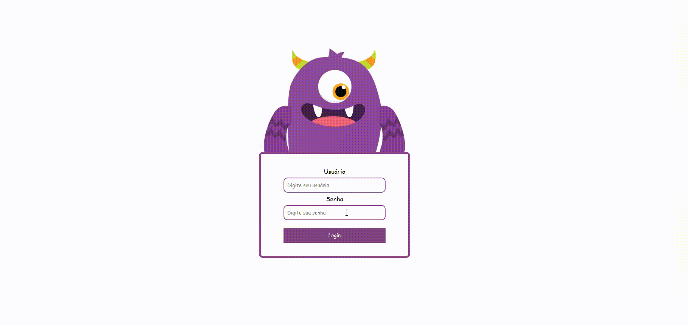

<div align="center" id="top"> 
  

  &#xa0;

  <a href="https://kevinfigueira.github.io/Animated-login-monster/">Demo</a>
</div>

<h1 align="center">Animated Login Monster</h1>

<p align="center">
  

  

  

  

  

  

  
</p>

<!-- Status -->

<!-- <h4 align="center"> 
	🚧  Animated Login Monster 🚀 Under construction...  🚧
</h4> 

<hr> -->

<p align="center">
  <a href="#dart-about">About</a> &#xa0; | &#xa0; 
  <a href="#sparkles-features">Features</a> &#xa0; | &#xa0;
  <a href="#rocket-technologies">Technologies</a> &#xa0; | &#xa0;
  <a href="#white_check_mark-requirements">Requirements</a> &#xa0; | &#xa0;
  <a href="#checkered_flag-starting">Starting</a> &#xa0; | &#xa0;
  <a href="#memo-license">License</a> &#xa0; | &#xa0;
  <a href="https://github.com/kevinfigueira" target="_blank">Author</a>
</p>

<br>

## :dart: About ##

A small project to practice the Javascript language, Login Moster aims to be very intuitive and lively, as well as when writing the email and password, the coolest part is that the little monster hides its eyes with its hand, moving the mouse too. you can see that he moves his eyes in all directions.

## :sparkles: Features ##

:heavy_check_mark: Responsive;\
:heavy_check_mark: intuitive and lively;\

## :rocket: Technologies ##

The following tools were used in this project:

- [Javascript](https://developer.mozilla.org/pt-BR/docs/Web/JavaScript)

## :white_check_mark: Requirements ##

You don't need to install anything, just clone the repository and try to do it yourself

## :checkered_flag: Starting ##

```bash
# Clone this project
$ git clone https://github.com/kevinfigueira/animated-login-monster

# Access
$ cd animated-login-monster

# Access
$ cd clone_spotify-bootstrap

# Install extension "Go live" or acess "address of your project
$ start extensio or acesss address

# The server will initialize in the <http://localhost:5500> in Go live
```

## :memo: License ##

This project is under license from MIT. For more details, see the [LICENSE](LICENSE.md) file.


Made with :heart: by <a href="https://github.com/kevinfigueira" target="_blank">Kevin Figueira</a>

&#xa0;

<a href="#top">Back to top</a>
